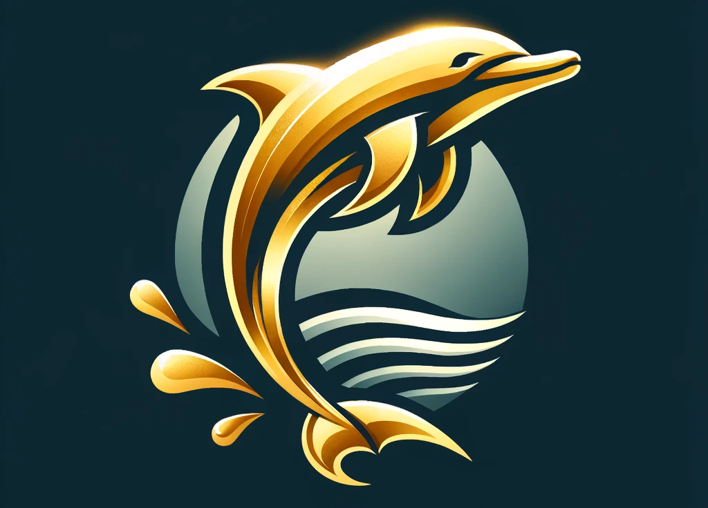

# Golden Dolphin



## Installation 🛠
```
pip install -r requirements.txt
```
## Usage 🚀
1. [data loader](docs/dataLoader.md)  


## Roadmap 📝  

1. signal generator
2. deep learning model
## Contributing ✨  

Welcome every one who interested in this field and project to contribute to this project.  

---
*Write your documentation in the doc dir and name the documentation with your module name. After that, add your documentation link in the [Support](#support). Tips, the image resource you refer to should be stored in img dir.*
## Support 🤔
Welcome to contact us:
* Email: bupt_wuyu@163.com
* WeChat:chrispaulxll
* Discord:https://discord.gg/WWrEQJz5

## Authors and acknowledgment 💕
coming soon
